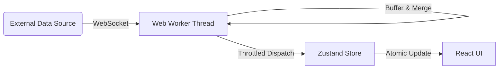

# TBT Exchange UI Kit


<div align="center">
  <h3>A Performance-Focused React Base for Crypto Exchanges</h3>
  <p>
    An open-source reference implementation for high-frequency trading interfaces.<br>
    Features <b>WebWorker data ingestion</b>, <b>order book merging</b>, and <b>decimal arithmetic</b> out of the box.
  </p>
  <br>
  <p>
    <a href="docs/README_ARCHITECTURE.md"><b>Architecture Documentation</b></a> |
    <a href="docs/benchmarks.md"><b>Performance Benchmarks</b></a>
  </p>
</div>

---

## 💎 Overview

<div align="center">
  
</div>

Developing a trading terminal requires solving typical engineering challenges: high-frequency state updates, main-thread blocking, and floating-point precision errors.

This repository provides a solid architectural foundation for these problems. It is designed to be **backend-agnostic**—while it connects to Binance Public Streams for demonstration, the data layer is decoupled and can be adapted to any WebSocket API.

### Key Capabilities

* **High-Frequency Updates**: Handles 50+ WebSocket messages/second via Worker thread offloading.
* **Client-Side Matching**: Includes a local matching engine (Limit, Market, Stop-Limit, OCO) for simulation or testing purposes.
* **Dual-Platform Architecture**: Serves distinct layouts for Mobile and Desktop users via adaptive routing.

---

## 🛠 Reusable Modules

The codebase is structured to allow developers to extract specific subsystems for their own projects.

| Module | Description | Location |
| :--- | :--- | :--- |
| **Order Book Engine** | Manages snapshot synchronization, incremental delta merging (`u`, `U`), and data integrity checks. | `src/worker/` |
| **Trading Logic** | Core order validation, balance checks, and matching logic for standard crypto order types. | `src/store/tradingStore.ts` |
| **Adaptive Layout** | A routing pattern that loads platform-specific component trees based on device capability. | `src/components/Layout/` |
| **Precision Math** | A strict wrapper around `decimal.js` to ensure safe financial calculations throughout the app. | `src/utils/decimal.ts` |

---

## 📱 Mobile Experience

The application implements a "Native-Like" web experience for mobile users. It eschews simple responsiveness for a dedicated mobile specific navigation structure and touch-optimized controls.

<div align="center">
  <table style="border: none; border-collapse: collapse; width: 100%;">
    <tr>
      <td align="center" width="25%" style="border: none; padding: 10px;">
        
        <br><b>Market List</b>
      </td>
      <td align="center" width="25%" style="border: none; padding: 10px;">
        
        <br><b>Order Entry</b>
      </td>
      <td align="center" width="25%" style="border: none; padding: 10px;">
        
        <br><b>Order Book</b>
      </td>
      <td align="center" width="25%" style="border: none; padding: 10px;">
        
        <br><b>Assets & PnL</b>
      </td>
    </tr>
  </table>
</div>

---

## ⚡ Architecture

The system uses a **Worker-first** approach to ensure the UI thread remains responsive under heavy load.



* **Ingestion**: `marketDataWorker` processes the raw WebSocket stream.
* **Throttling**: Updates are batched and dispatched to the main thread at a fixed 60fps interval.
* **State**: Business logic is isolated in Stores and Workers, keeping React components purely presentational.

---

## 🚀 Quick Start

1. **Clone the repository**

    ```bash
    git clone https://github.com/TheNewMikeMusic/tbt-paper-terminal.git
    cd tbt-paper-terminal
    ```

2. **Install dependencies**

    ```bash
    npm install
    ```

3. **Start development server**

    ```bash
    npm run dev
    # -> http://localhost:5173
    ```

4. **Start the local API server** (used by the UI proxy at `/live-api`)

    ```bash
    npm run server
    # -> http://localhost:4010
    ```

Tip: from the repo root, you can run `npm run dev` to start both the UI and API together.

---

<p align="center">
  <sub>Open Source (Apache-2.0). Free to fork and adapt for commercial or private projects.</sub>
</p>
