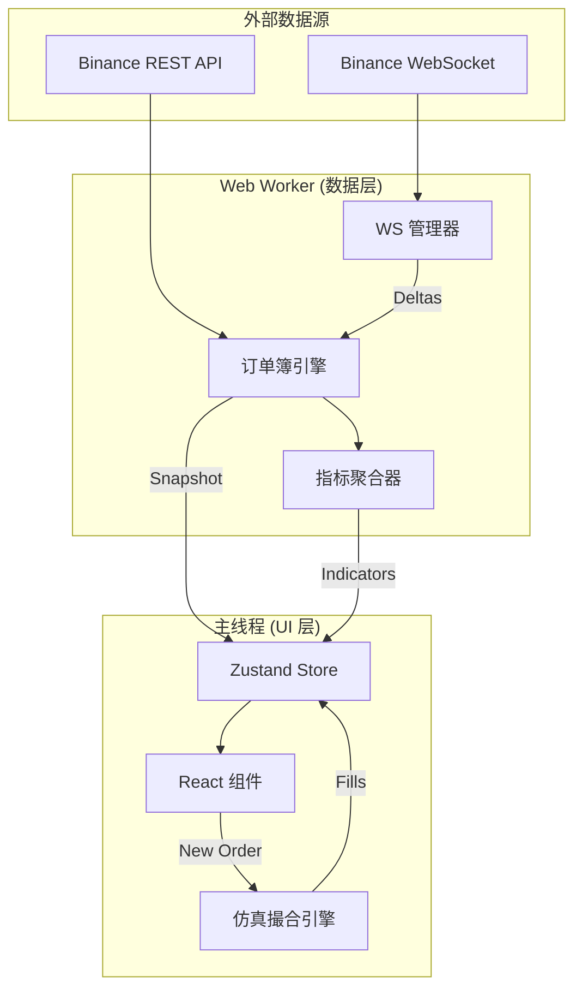

# 🚀 TBT 仿真交易终端

<p align="center">
  
</p>

<p align="center">
  <b>面向专业交易者的加密货币仿真交易终端。</b><br>
  体验机构级的数据处理能力与专业级 UI，零资金风险验证策略。
</p>

<p align="center">
  
  
  
  
  
</p>

---

## ✨ 功能亮点

### 📊 市场情报
*   **高保真订单簿**：实时 Snapshot + Delta 合并，具备序列校验与自动重连同步功能。
*   **微观结构指标**：内置 8 个实时计算指标，包括 **买卖盘失衡 (Imbalance)**、**微观波动率** 和 **VWAP**。
*   **数据可信度条**：全透明展示连接状态、网络延迟 (RTT) 和数据新鲜度。

### ⚡ 专业交易引擎
*   **聚焦模式 (Focus Mode)**：下单时智能锁定布局，确保在高频行情下精准操作。
*   **仿真撮合**：基于 Binance 真实流动性的限价单与市价单模拟成交。
*   **风险丝带 (Risk Ribbon)**：直观展示仓位占比、未实现盈亏与波动风险。

### 🎨 现代 UI/UX
*   **双色主题**：原生支持深色 (Dark) 与浅色 (Light) 模式。
*   **性能优先**：将高强度计算（订单簿合并、指标计算）移至 **Web Workers** 线程。
*   **无障碍支持**：色弱友好设计 (▲▼ 符号辅助) 与制表符数字字体。

---

## 📸 界面预览

| 🌓 浅色模式 | 🌑 深色模式 |
|:---:|:---:|
|  |  |
| *清晰专业的排版设计* | *专为长会话交易优化的深色美学* |

---

## 🛠 技术栈

专为速度、精度和工程教学而设计。

*   **核心**：React 18 + TypeScript
*   **状态管理**：Zustand (原子级订阅)
*   **数据处理**：Web Workers (独立线程处理流式数据)
*   **金融计算**：`decimal.js` 确保精度，避免浮点误差
*   **图表可视化**：`lightweight-charts` 提供高性能 K 线展示

---

## 📉 8 大核心衍生指标

终端在后台 Worker 中每 100ms 计算一次以下指标：

1.  **中间价 (Mid Price)**：市场公允价值基准。
2.  **买卖价差 (Spread)**：实时流动性成本（绝对值与基点）。
3.  **买卖盘失衡 (Imbalance)**：买卖压力信号 (-1 到 +1)。
4.  **微观波动率 (Volatility)**：过去 60s 的滚动风险评估（Welford 算法）。
5.  **成交强度 (Intensity)**：市场活跃度脉搏（每 10s 成交笔数）。
6.  **VWAP (60s)**：成交量加权平均价。
7.  **流动性评分**：对数归一化的深度/价差比 (0-100)。
8.  **滑点预估 (Slippage)**：模拟市价单对当前盘口的冲击影响。

---

## 🏗 系统架构



---

## 🚀 快速开始

```bash
# 克隆仓库
git clone https://github.com/TheNewMikeMusic/tbt-paper-terminal.git

# 安装依赖
npm install

# 启动开发服务器
npm run dev

# 运行单元测试
npm test
```

---

## ⚠️ 免责声明

- **非投资建议**：本项目仅用于工程教育和作品集展示。
- **仅限仿真交易**：不涉及任何真实资金，不执行真实交易。
- **数据来源**：使用 Binance 公开 API，与 Binance 无任何隶属关系。

---

<p align="center">
  用 ❤️ 为交易社区打造。
</p>


