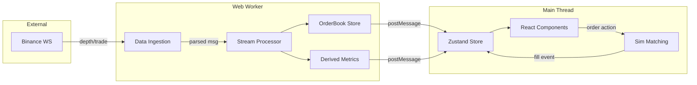
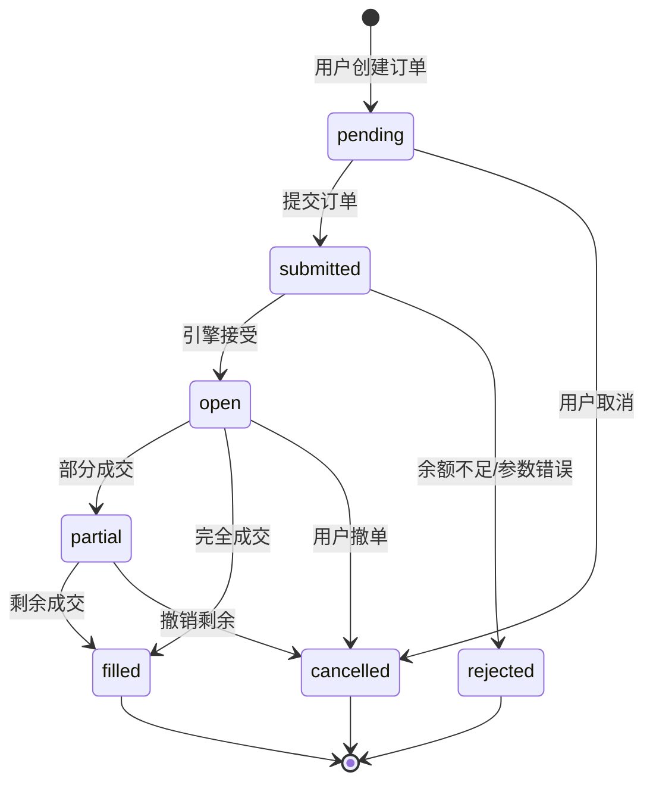

# 虚拟货币仿真交易终端 - 工程设计 Plan

## 1) 一句话产品定义

定位：面向有一定经验的加密货币交易者/量化爱好者的仿真交易终端，使用真实市场数据进行零风险策略验证与交易训练。

目标用户：

- 想验证手动交易策略但不愿承担真实资金风险的交易者
- 学习市场微观结构（order book、成交流）的技术爱好者
- 准备面试量化/交易相关岗位、需要作品集证明数据处理能力的开发者

核心场景：实时观察 BTC/USDT 等主流交易对的盘口与成交，下达仿真限价/市价单，观察模拟成交结果与持仓损益。

非目标（明确不做）：

- 不连接真实资金账户，不执行真实交易
- 不提供任何投资建议或信号推荐
- 不做高频策略回测引擎（聚焦实时仿真而非历史回放）
- 不做多交易所聚合（MVP 聚焦单一数据源的正确性）
- 不支持杠杆/保证金/借币交易（仅现货仿真）

免责声明（防误读）：

- 本项目与 Binance 无任何合作或隶属关系，仅使用其公开市场数据
- 数据可能存在延迟或丢失，UI 会显式提示数据状态，不承诺实时性
- 仅用于学习与作品集演示目的

---

## 2) 评审关切清单

### 正确性

| 关切点 | 应对策略 |
|---|---|
| Order book 一致性 | snapshot + delta 合并，sequence 校验，gap 触发 resync |
| 仿真撮合幂等性 | 订单 ID 客户端生成（UUID），状态机禁止非法跃迁 |
| 数值精度 | 价格/数量使用 string 存储，计算层用 decimal.js |
| 边界条件 | 空盘口、零流动性、价格跳空均有显式处理逻辑 |

### 可观测性

| 指标类型 | 具体内容 |
|---|---|
| 连接层 | WS 状态、重连次数、心跳 RTT、消息速率 |
| 数据层 | gap 计数、resync 次数、stale 时长、queue 长度 |
| 渲染层 | FPS、主线程阻塞时长、输入延迟 |
| 业务层 | 订单状态变更事件、成交记录、持仓快照 |

### 失败模式与缓解

| 失败场景 | 缓解策略 |
|---|---|
| WebSocket 断线 | 指数退避重连，最大 5 次/分钟，UI 明确提示 |
| 消息乱序/丢包 | sequence 检测，触发 REST snapshot 重建 |
| 流量突刺 | Trade 降采样 + Depth 强制 resync（见 Backpressure 策略） |
| 渲染抖动 | requestAnimationFrame 节流，价格变化 batch |
| 输入丢焦点 | 下单区域与行情更新隔离，数据更新不触发重渲染输入组件 |

### 合规边界

- 仅使用交易所公开市场数据 API（无需 API Key）
- 所有订单/持仓/资金完全本地模拟
- UI 明确标注“仿真交易，不构成投资建议”

---

## 3) 系统架构总览

### 分层架构

```
┌─────────────────────────────────────────────────────────────────┐
│                        UI Rendering Layer                        │
│  React + Zustand (局部订阅) + CSS Variables + requestAnimationFrame │
│  - 行情组件：只订阅需要的 slice，避免全局 re-render              │
│  - 下单组件：完全隔离，不受行情更新影响                          │
└───────────────────────────┬─────────────────────────────────────┘
                            │ postMessage (结构化数据)
┌───────────────────────────┴─────────────────────────────────────┐
│                     Stream Processing (Web Worker)               │
│  - 事件总线：消息分发与优先级队列                                │
│  - 聚合器：order book 合并、派生指标计算                        │
│  - 降采样：非关键路径 100ms 节流，关键路径 16ms                  │
│  - 异常检测：gap/stale/spike 检测与标记                          │
└───────────────────────────┬─────────────────────────────────────┘
                            │ 内部消息队列
┌───────────────────────────┴─────────────────────────────────────┐
│                     Data Ingestion (Web Worker)                  │
│  - WebSocket 连接管理：心跳、重连、背压控制                      │
│  - Provider 抽象：IMarketDataProvider 接口                       │
│  - 协议解析：JSON parse + schema 校验                            │
└───────────────────────────┬─────────────────────────────────────┘
                            │ WebSocket / REST
┌───────────────────────────┴─────────────────────────────────────┐
│                     External Data Source                         │
│  Binance Spot WebSocket (wss://stream.binance.com)              │
│  参考官方文档：Binance WebSocket Streams / Diff. Depth Stream   │
└─────────────────────────────────────────────────────────────────┘
```

### 线程分配决策

| 模块 | 线程 | 理由 |
|---|---|---|
| WebSocket 连接 + 解析 | Dedicated Worker | 隔离网络 I/O，避免主线程阻塞 |
| Order book 合并 + 派生指标 | Shared Worker 或同一 Worker | 计算密集，需与 ingestion 同步访问 |
| 仿真撮合引擎 | 主线程 | 事件稀疏；与 Zustand 状态强耦合，减少跨线程序列化 |
| UI 渲染 | 主线程 | React 渲染必须在主线程 |

### 数据流 Mermaid 图



---

## 4) 数据源与协议处理细节

### 数据源选择：Binance Spot

选择理由：

- 全球最大现货交易所，流动性充足，数据代表性强
- 公开 WebSocket 无需 API Key，符合作品集场景
- 文档完善，diff depth stream 支持增量更新
- 社区案例丰富，便于验证实现正确性

备选方案：OKX、Bybit（均支持公开 WS，但 Binance 文档最成熟）。参考官方文档：Binance WebSocket Streams / Diff. Depth Stream / Trade Streams。

### Order Book 正确性策略（Binance Diff Depth）

1) 初始化：

- 订阅 `depth@100ms` 或 `depth@1000ms` stream
- 同时请求 REST `GET /api/v3/depth?limit=1000` 获取 snapshot（含 `lastUpdateId`）

2) 增量合并：

- diff 消息包含 `U`（first update ID）、`u`（last update ID）
- 合并条件：`U <= lastUpdateId + 1` 且 `u >= lastUpdateId + 1`
- 更新后：`lastUpdateId = u`

3) Gap 检测：

- 若收到消息 `U > lastUpdateId + 1`，说明有丢包，立即触发 REST snapshot 重建

4) 重建触发条件：

- Gap 检测到；连续 3 条消息校验失败；WebSocket 重连后

5) Resync 冷却策略：

- 重建间隔最小 5 秒，避免 REST 限流；重建期间标记 `stale`，UI 显示警告

无法严格保证的点（必须坦诚）：

- Binance diff stream 本身有 100ms/1000ms 延迟，非真正逐笔
- REST snapshot 与 WS 消息之间存在时间窗口，首次合并可能丢少量更新
- 公开 API 无 SLA，高峰期可能延迟波动

风险缓解：

- UI 始终显示数据新鲜度指标（最后更新时间、延迟估算）
- 关键操作（下单确认）时二次校验盘口时效性

### 频率与带宽控制

| 数据类型 | 原始频率 | 处理策略 |
|---|---|---|
| Depth diff | 100ms | 直接处理，合并到 order book |
| Trade stream | 实时（~10-100/s 高峰） | Worker 端 50ms batch |
| 派生指标 | - | 100ms 计算周期 |
| UI 更新 | - | requestAnimationFrame (~16ms) |

Backpressure 策略（区分可丢/不可丢）：

- Depth diff 消息：不可丢弃；若队列压力过大，标记 stale + 触发 REST resync
- Trade 消息：可降采样/丢弃，保留最新 N 条用于 UI 与指标
- Worker 消息队列长度阈值：100（警告）、500（Trade 降采样）、1000（强制 resync）
- 丢弃/降采样记录日志，计入 `dropped_messages` / `trade_downsampled`

### 时间与对齐

- 服务器时间 `E`（event time）；本地时间 `performance.now()`
- 延迟估算：`local_receive_time - server_event_time`
- UI 标注：显示“数据延迟约 X ms”，超过 500ms 标红

---

## 5) 核心数据模型

### 数值精度策略

价格/数量字段存储为 `string`，计算时使用 `decimal.js`。

- Number 浮点误差；交易所 API 返回 string；显示直接用原始 string

### TypeScript 类型定义（语义层）

```typescript
// 市场数据
interface Trade { /* ...见仓库 src/types/market.ts ... */ }
interface OrderBookLevel { /* ... */ }
interface OrderBook { /* ... */ }
interface Candle { /* ... */ }

// 仿真交易
type OrderStatus = 'pending'|'submitted'|'open'|'partial'|'filled'|'cancelled'|'rejected'
type OrderSide = 'buy' | 'sell'
type OrderType = 'limit' | 'market'
interface PaperOrder { /* ...见 src/types/trading.ts ... */ }
interface Fill { /* ... */ }
interface Position { /* ... */ }
interface AccountBalance { /* ... */ }
```

---

## 6) 流式数据处理与派生指标

### 派生指标设计（8 个增量可计算指标）

| 指标名 | 公式/算法 | 更新频率 | 用途 |
|---|---|---|---|
| mid | (bestBid + bestAsk) / 2 | 每次 OB 更新 | 中间价，持仓盈亏基准 |
| spread | bestAsk - bestBid；输出 spreadBps | 每次 OB 更新 | 流动性直观指标 |
| bidAskImbalance | (bidQty - askQty) / (bidQty + askQty)，前 5 档 | 每次 OB 更新 | 买卖压力，-1~+1 |
| microVolatility | 过去 60s mid 的标准差（Welford） | 1s 滑动 | 短期波动率 |
| tradeIntensity | 过去 10s 成交笔数 | 1s 滑动 | 市场活跃度 |
| vwap60s | Σ(price*qty)/Σ(qty) 过去 60s | 每笔成交 | 成交量加权均价 |
| liquidityScore | clamp(50 + 10*log10(depth10/spread),0,100) | 每次 OB 更新 | 流动性评分 |
| slippageEst | 模拟市价单 X 数量的平均成交价与 mid 差 | 每次 OB 更新 | 滑点预估 |

增量更新示例：

- microVolatility：60 元素环形缓冲 + Welford 在线算法（O(1)）
- tradeIntensity：时间戳队列维护近 10s，入队出队 O(1)

### 性能预算

| 指标 | 预算 | 监控方式 |
|---|---|---|
| 消息处理速率 | ≤ 200 msg/s | Worker 内计数器 |
| Worker 队列长度 | ≤ 100（警告）≤ 1000（丢弃） | 定期采样上报 |
| 派生指标计算耗时 | ≤ 2ms/批 | performance.mark |
| 主线程帧预算 | ≤ 16ms（60fps） | requestAnimationFrame |
| 内存占用 | ≤ 50MB | performance.memory |

---

## 7) 订单状态机与仿真撮合

### 状态流转图



### 状态与 UI 约束映射

| 状态 | 可撤单 | 可修改 | 显示样式 | 按钮状态 |
|---|---|---|---|---|
| pending | 是 | 是 | 灰色斜体 | “提交”可用 |
| submitted | 否 | 否 | 黄色闪烁 | 全部禁用 |
| open | 是 | 否 | 正常 | “撤单”可用 |
| partial | 是 | 否 | 绿色+进度条 | “撤单”可用 |
| filled | 否 | 否 | 绿色 | 查看详情 |
| cancelled | 否 | 否 | 灰色删除线 | 无 |
| rejected | 否 | 否 | 红色 | 查看原因 |

### 仿真撮合逻辑（简化、教学向）

- 限价单：买 `order.price >= bestAsk`，卖 `order.price <= bestBid`；量为 `min(剩余, 档位可用量)`
- 市价单：逐档吃单，记录每档价格，计算加权均价
- 滑点：基于当前盘口深度逐档模拟
- 延迟：提交到成交 50-200ms 随机延迟
- 不模拟：止损/止盈/追踪止损、撮合队列、市场冲击成本、杠杆与借币

---

## 8) 视觉语言与设计系统

### 设计目标

- 专业：信息密度高但不杂乱，老手一眼能找到所需
- 可信：数据状态透明，不隐藏不确定性
- 稳定：视觉不跳动，布局可预测，操作有反馈
- 低焦虑：告警克制，风险可视但不恐吓

不做：游戏化炫酷风格、过度动效、花哨配色

### Light/Dark 双模式

| 元素 | Light Mode | Dark Mode |
|---|---|---|
| 背景主色 | #FAFBFC | #0D1117 |
| 卡片背景 | #FFFFFF | #161B22 |
| 文字主色 | #1F2328 | #E6EDF3 |
| 文字次级 | #656D76 | #8B949E |
| 边框 | #D1D9E0 | #30363D |
| 分割线 | #D8DEE4 | #21262D |

### 设计 Token（4px 基准）

- 间距：1=4px, 2=8px, 3=16px, 4=24px, 5=32px
- 圆角：sm=4px, md=8px, lg=12px
- 阴影（Light）：sm `0 1px 2px rgba(0,0,0,0.05)`；md `0 4px 12px rgba(0,0,0,0.08)`
- 字体：IBM Plex Sans / IBM Plex Mono（tabular-nums）

### 色彩与可访问性

- 涨：#16A34A（Light）/#22C55E（Dark）；跌：#DC2626/#EF4444
- 警告：#CA8A04/#FACC15；错误：#DC2626；成功：#16A34A；信息：#2563EB
- 色弱友好：涨跌配合 ▲▼；对比度达 WCAG AA；焦点样式明确

### 动效规范

- 只用于状态变化反馈；价格变动 0.15s 背景闪烁；切换 0.2s ease-out；弹窗 0.15s fade+scale
- 禁止：无限循环、大于 0.3s 过渡、影响布局动画

### 组件规范（举例）

- 表格：表头固定、行高 40px、数字右对齐
- 按钮：Primary/Secondary/Danger，禁用 50% 透明 + not-allowed
- 输入框：高 40px，聚焦边框加深 + 微阴影，错误态红框
- Toast：右下角最多 3 条；成功 3s、错误 5s
- Tooltip：300ms 延迟，最大宽 280px

---

## 9) 有用的创新点（5 个）

### 9.1 数据可信度条（Data Confidence Bar）

- 固定顶部，显示连接状态 + 延迟 + 最后更新时间；颜色编码：绿(<100ms)/黄(100-500ms)/红(>500ms)
- 点击展开详情：重连次数、gap 次数、会话统计；增强信任、不干扰交易

### 9.2 指标可解释面板（Explainability Panel）

- 指标旁 `ⓘ` 展开：公式、输入值、过程分解、5 分钟趋势；默认收起

### 9.3 风险丝带（Risk Ribbon）

- 持仓卡片底部 8px 细条：仓位占比、未实现盈亏%、近 60s 波动风险；悬停显示详情

### 9.4 聚焦模式（Focus Mode）

- 输入下单数量激活：下单区域布局锁定；非下单区域降对比度；关键价格用边框闪烁；提交/取消后退出

### 9.5 微观结构透镜（Microstructure Lens）

- 盘口旁深度柱状图：买左绿、卖右红、对数刻度；可选显示累积曲线；最近成交以闪点标注

---

## 10) 异常体验与可观测性

### 指标采集

| 指标名 | 类型 | 采集点 | 告警阈值 |
|---|---|---|---|
| ws_connection_state | Gauge | Worker | 非 OPEN 状态 |
| ws_reconnect_count | Counter | Worker | > 5/分钟 |
| ws_message_rate | Gauge | Worker | < 1/s 或 > 500/s |
| ws_heartbeat_rtt_ms | Histogram | Worker | > 1000ms |
| ob_gap_count | Counter | Processor | > 0 |
| ob_resync_count | Counter | Processor | > 3/分钟 |
| ob_stale_duration_ms | Gauge | Processor | > 500ms |
| worker_queue_length | Gauge | Worker | > 100 |
| main_thread_fps | Gauge | Main | < 30 |
| input_latency_ms | Histogram | Main | > 100ms |
| render_time_ms | Histogram | Main | > 16ms |

### 日志事件（结构化）

```typescript
interface LogEvent {
  timestamp: number;
  level: 'debug' | 'info' | 'warn' | 'error';
  category: 'ws' | 'orderbook' | 'order' | 'system';
  event: string;
  data: Record<string, unknown>;
}
// 示例事件：
// ws.subscribe_success, ws.reconnect_start, ws.heartbeat_timeout
// ob.gap_detected, ob.resync_start, ob.stale_enter/exit
// order.created, order.filled, order.cancelled, order.rejected
```

### 测试策略

- 单元：Order book 合并（正常/Gap/空盘口）、派生指标（边界/精度）、订单状态机（合法/非法转换）
- 集成：WS mock 乱序/丢包/延迟；仿真撮合端到端
- 性能：FPS 60、输入延迟 < 50ms、1 小时运行无泄漏
- 可复现：支持 5 分钟数据流录制与 replay（JSON Lines 带时间戳）

---

## 11) MVP 里程碑拆解

### Phase 1: 数据层稳定（2 周）

- 交付：WS + OB 合并、指标（mid/spread/imbalance）、基础 UI、可信度条、可观测性埋点
- 风险：API 变更（低概率）、合并边界遗漏
- 证据：gap 检测/触发 resync/stale 标记日志；与官网对比截图

### Phase 2: 交易闭环（2 周）

- 交付：下单（限价/市价）、订单状态机、撮合、持仓与账户、聚焦模式
- 风险：状态机边界遗漏；撮合与真实差异
- 证据：下单→成交→持仓录屏；状态机测试覆盖；撮合与盘口对比说明

### Phase 3: 体验打磨（1.5 周）

- 交付：主题双模式、8 指标 + 可解释面板、风险丝带、深度图、性能优化（Worker）、设计 System Token
- 风险：设计/开发品质不一致；性能未达预期
- 证据：设计系统文档、Lighthouse 报告、极端行情演示录屏

---

## 12) 风险与取舍清单

### 无法 100% 准确的点

| 风险点 | 原因 | 缓解措施 |
|---|---|---|
| Order book 首次合并窗口 | REST snapshot 与 WS 消息有时间差 | 短暂 stale 标记 + 快速 resync |
| 数据延迟 | 公开 API 无 SLA，网络波动 | 显式延迟指标，超阈值告警 |
| 仿真撮合与真实差异 | 不模拟真实撮合队列 | 文档说明，聚焦教学目的 |
| 时钟偏差 | 本地与服务器时钟不同步 | 显示相对延迟，不做绝对判断 |

### 故意不做的功能

| 功能 | 不做原因 |
|---|---|
| 多交易所聚合 | MVP 聚焦单源正确性，聚合增加复杂度 |
| 历史回测 | 重心是实时仿真，回测是另一个项目 |
| 条件单/高级单 | 增加状态机复杂度，收益不大 |
| 真实 API Key 连接 | 合规风险，作品集不需要 |
| 移动端适配 | 桌面优先，移动端体验差异大 |

### 创新点可能被质疑的回应

| 创新点 | 可能质疑 | 回应 |
|---|---|---|
| 数据可信度条 | 太显眼，影响视觉 | 专业用户核心需求，Bloomberg 同类设计 |
| 指标可解释面板 | 新手不需要 | 可折叠不影响使用，展示理解深度 |
| 风险丝带 | 信息密度低 | 概览补充，减少认知负担 |
| 聚焦模式 | 遮挡信息 | 信息仍更新，可随时退出 |

---

文档版本: v1.1（修复口径一致性问题）  
预计评审时间: 60-90 分钟  
作者角色: 前端架构师（交易系统方向）

v1.1 修订记录：

- 删除保证金/杠杆相关表述（仅现货仿真）
- Position.side 收敛为 `long | flat`
- 明确撮合基于盘口深度逐档成交，但不模拟 market impact
- 区分 Depth diff（不可丢弃）与 Trade（可降采样）的 Backpressure 策略
- liquidityScore 补充对数归一化公式

